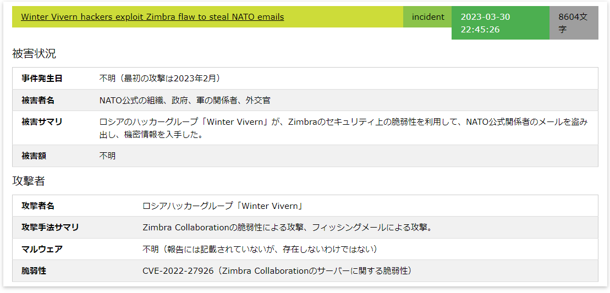
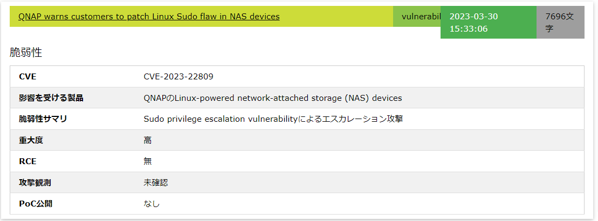

# セキュリティニュースまとめる君
ChatGPTのAPIを用いて、セキュリティニュースを分類・要約するプログラムです。 
出力例   



* DockerベースのWebアプリとPythonスクリプトです。
* デフォルトは[Bleeping Computer](https://www.bleepingcomputer.com/)のニュース記事のみを取得しています。
* 開発記  
[](https://speakerdeck.com/sh1n0g1/chatgpt-apidesekiyuriteiniyusuwoyao-yue-surusisutemuwozuo-tutemita)


## システム要件
* Linux
* Docker

## セットアップ(10分程度)
1. `git clone https://github.com/Sh1n0g1/security_news_matomerukun.git`
1. `cd security_news_matomerukun`
1. APIキーを[OpenAI社](https://platform.openai.com/account/api-keys)から入手します。
    * ユーザ登録が必要となります。
    * クレジットカードによる月次決済が必要です。
    * 費用については1記事(4000単語想定）あたり0.2円程度です。
1. `vim ./scripts/matomerukun_config.py`でOpenAI社のAPI Keyを入力します。  
  `openai_key="changeme"`
1. 以下のコマンドでDocker Imageを作成します。  
`docker build . -t security_matomeru`  
    * 完了するのに5分ほどかかります。
1. コンテナを実行します。  
`docker run -p 80:80 security_matomeru`  
Pythonスクリプトが実行されます。1記事1分くらいの速さで取得・分類・要約が行われます。  
環境によって処理が以下のログで途中で止まっているように見えますが、正常に動作しています。
```
 * Starting Apache httpd web server apache2
AH00558: apache2: Could not reliably determine the server's fully qualified domain name, using 172.17.0.2. Set the 'ServerName' directive globally to suppress this message
 * 
[*] Security News Watcher
[+] Getting CSS...
[*] Title:記事のタイトル
[+] Getting Text...
[WDM] - Downloading: 100%|██████████| 6.83M/6.83M [00:00<00:00, 11.7MB/s]
```

## 使い方
1. ブラウザで`http://ホストのIPアドレス/`にアクセスすると要約された記事が読めます。
    * 起動したばかりだと記事がありませんが、RSSのエントリー分だけ1記事1分のペースで新しい記事が増えていきます。
1. それ以降の記事の更新(RSSの再チェック)は自動的に1時間おきに行われます。

## Dockerコンテナの終了および消し方
### コンテナの終了
* `docker ps`で起動しているコンテナ一覧を表示させて、`security_news`イメージの名前(`NAMES`列）を確認する
* `docker stop <コンテナのNAME>`でコンテナを停止します。
### コンテナの削除
* `docker rm  <コンテナのNAME>`でコンテナを削除します。
* `docker ps -a`でコンテナ一覧が表示できます。コンテナが消えていることを確認します。
### イメージの削除
* `docker rmi security_news`でイメージを削除します。
* `docker images`でイメージ一覧を取得し、`security_news`イメージがないことを確認します。


## カスタマイズ
以下の項目がロジックを変更することなく、簡単にカスタマイズ可能です。

### スクリプト内
`script/matomerukun_config.py`の以下の部分がカスタマイズできます。
```python

USER_AGENT='Mozilla/5.0 (Windows NT 10.0; Win64; x64) AppleWebKit/537.36 (KHTML, like Gecko) Chrome/111.0.0.0 Safari/537.36'
INTERVAL=3600 # 1 hour
rss_urls = ['https://www.bleepingcomputer.com/feed/']
categories=["incident", "vulnerability", "other"]
```
* `USER_AGENT`:ニュース記事を取得する際のUserAgent
* `INTERVAL`:RSSをチェックする間隔
* `rss_urls`:RSSのURL
* `categories`:カテゴリ
  * カテゴリを追加する場合、`prompt_categorize.txt`を更新し、`prompt_<category>.txt`を作成する必要があります。

### ChatGPTに対するプロンプト
`script/prompt_*.txt`となっているテキストファイルはChatGPTに送る命令の内容です。
* `prompt_categorize.txt`:記事の分類
* `prompt_incident.txt`:インシデントの記事のサマリ
* `prompt_vulnerability.txt`:脆弱性の記事のサマリ
* `prompt_other.txt`:その他の記事の記事のサマリ

### Webサイト
* `html/index.php`内の`$ARTICLES_PER_PAGE=10;`
* 1ページ当たりに表示する記事の数

## トラブルシューティング
### 記事のエラー表示
* 記事の取得に失敗した場合、Web上ではエラーは非表示になっています。
* エラーを表示する場合はURLのGETパラメータに`error`をつくてください。  
```http://<IPアドレス>/?error```  
```http://<IPアドレス>/?page=2&error```  

### 動作中のコンテナのシェルを起動させる
* `docker ps`で動作しているコンテナの`NAMES`を確認する
* `docker exec -it <コンテナのNAME> /bin/bash`
* `ps -aux`をコマンドを実行すると以下が正しい実行中プロセス一覧となります。
```
USER         PID %CPU %MEM    VSZ   RSS TTY      STAT START   TIME COMMAND
root           1  0.0  0.0   2888   468 ?        Ss   Mar31   0:00 /bin/sh -c service apache2 start; python3 /var/www/scripts/security_news_w
root          25  0.0  0.6 199888 12360 ?        Ss   Mar31   0:01 /usr/sbin/apache2 -k start
www-data      30  0.0  0.6 200420 14060 ?        S    Mar31   0:00 /usr/sbin/apache2 -k start
www-data      31  0.0  0.5 200420 12060 ?        S    Mar31   0:00 /usr/sbin/apache2 -k start
www-data      32  0.0  0.6 200420 12088 ?        S    Mar31   0:00 /usr/sbin/apache2 -k start
www-data      33  0.0  0.5 200420 12064 ?        S    Mar31   0:00 /usr/sbin/apache2 -k start
www-data      34  0.0  0.5 200420 12016 ?        S    Mar31   0:00 /usr/sbin/apache2 -k start
root          37  0.0  1.9 120088 39384 ?        Sl   Mar31   0:03 python3 /var/www/scripts/security_news_watcher.py
www-data     282  0.0  0.5 200420 10808 ?        S    Mar31   0:00 /usr/sbin/apache2 -k start
root        1531  0.5  0.1   4624  3680 pts/0    Ss   01:22   0:00 /bin/bash
root        1539  0.0  0.1   7368  3100 pts/0    R+   01:22   0:00 ps -aux
```
* ApacheとPythonのプロセスが動いていれば正常です。
* 以下のコマンドで取得済みの記事一覧のJSONファイルを確認することができる。
  * `ls -l /var/www/articles/`
* 以下のコマンドでウェブのログを確認することができる。
  * `tail -f /var/log/apache2/access.log`
  * `tail -f /var/log/apache2/error.log`